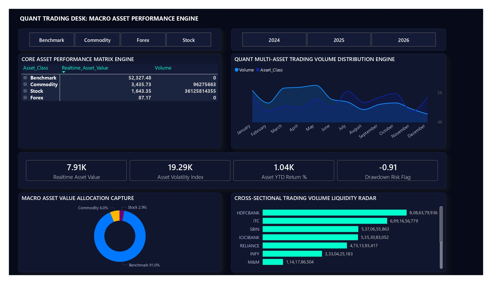
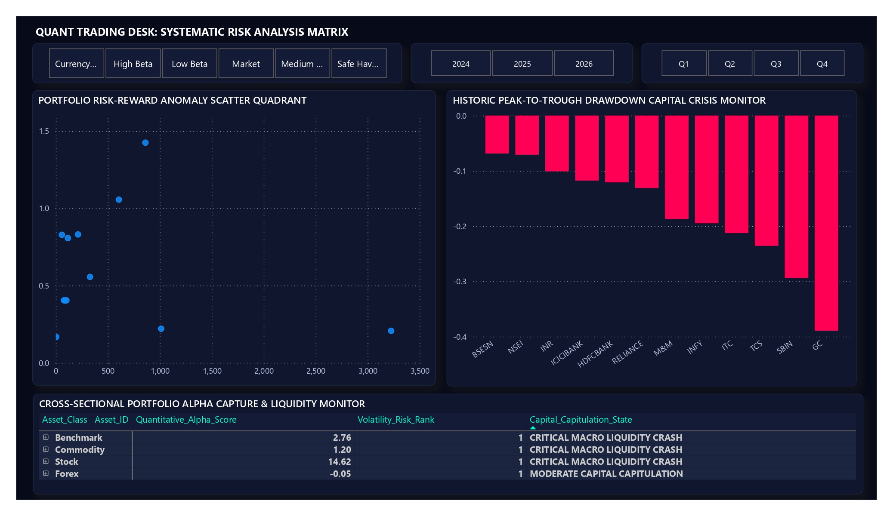
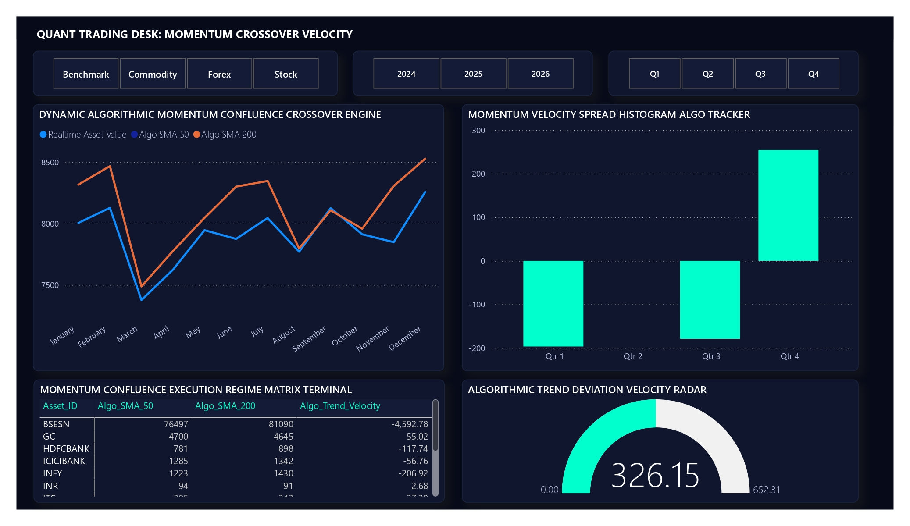
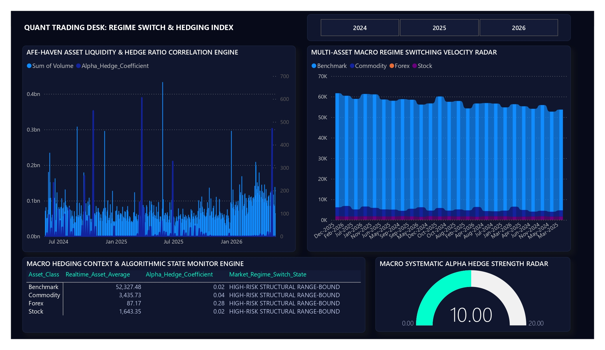

# 🏛️ Institutional-Grade Multi-Asset Algorithmic Execution & Quantitative Performance Terminal
> An enterprise-grade, high-granularity 4-page analytics application suite engineered for deep time-series parsing, portfolio alpha modeling, and systematic market volatility risk management across 56,000+ hourly market data records.

---

## 📸 Dashboard Preview

### 🔹 Macro Asset Console


---

### 🔹 Risk Deep Dive Engine


---

### 🔹 Algorithmic Alpha Radar


---

### 🔹 Macro Hedging Suite


---

## ⚙️ Technology Stack

| Layer | Technologies |
|---|---|
| Data Extraction | Python, yFinance API |
| Data Processing | Pandas, Power Query (M Language) |
| Data Modeling | Star Schema, Relational Modeling |
| Analytics Engine | DAX Measures |
| Visualization | Microsoft Power BI |
| Asset Coverage | Equities, Benchmarks, Forex, Commodities |

---

## 📂 1. Repository Layout Architecture & File Matrix

To ensure strict compliance with professional engineering standards, all code modules, local binary dataset matrices, and analytical reports are distributed across the following isolated structural hierarchy:

```text
Project_4_Institutional_MultiAsset_Quant_Execution_Terminal/ 
│
├── data/
│   ├── raw/
│   │   ├── Dim_Assets.csv                   # Asset baseline classifications and risk mapping reference sheet
│   │   └── Fact_Market_Prices/              # Contains all 12 raw historical hourly data CSV files from Python API
│   └── calendar/
│       └── Dim_Date.csv                     # Granular date dimension calendar records table
│
├── source_code/
│   ├── python_ingestion_engine/             # Master automation etl pipeline to handle metadata creation & sequential fetches
│   │   ├── create_dim_assets.py
│   │   ├── extract_market_data.py
│   │   └── fallback_asset_loader.py
│   └── PowerQuery_M_Casting_Engine.m        # Deep schema mapping data sanitization M-script
│
├── reports/
│   └── Institutional_MultiAsset_Quant_Execution_Terminal.pbix   # Main Power BI analytical application engine
│
├── exports/				      # High-definition visual system screenshot layout
│   ├── 1_Macro_Asset_Console.png            
│   ├── 2_Risk_Deep_Dive_Engine.png
│   ├── 3_Algorithmic_Alpha_Radar.png
│   └── 4_Macro_Hedging_Suite.png
│
├── docs/
│   ├── Business_Requirements_Quant.pdf      # Algorithmic parameter boundaries specification
│   ├── Domain_Overview_HedgeFunds.pdf       # Systematic finance macro framework brief
│   ├── executive_summary.md                 # Multi-asset portfolio alpha capture brief
│   └── methodology.md                       # Rolling averages and mathematical covariance logic
│
├── .gitignore
│
├── README.md                                # Complete system documentation root file
│ 
└── requirements.txt                         # Python dependency packages
```

---

## 🎯 2. System Challenge & Technical Core Problem Statement

Traditional corporate and retail business intelligence solutions historically evaluate performance on delayed end-of-day (EOD) daily closes. This delayed analysis completely flattens intraday volatility, leaving portfolio tracking engines blind to high-frequency drawdown traps, systemic capital erosion, and localized market regime shifts.

To capture actionable risk and momentum markers, this terminal targets high-density historical timelines running at a **1-Hour execution frequency interval**. However, processing hourly data across diverse global asset verticals (Equities closing on fixed local schedules, Forex trading continuously, and Commodities settling on distinct timestamps) creates a severe **Data Engineering Bottleneck**:

1. **Schema Mismatch Failures:** Market-close intervals inject extensive white-space fields (`" "`) and textual trailing `null` values straight into the database pipelines, causing standard mathematical aggregation columns to immediately break down during engine compile cycles.
2. **Datatype Conflicts:** Mixing raw scalar price integers with textual timestamps forces cross-filtering crashes when executing advanced time-series window queries inside the visual layouts.
3. **The Resolution:** Engineered an automated multi-stage python orchestration pipeline combined with a fallback exception-handling M-Language hard-casting framework to feed an optimized single-direction downstream relational data model.

---

## 🏗️ 3. Step-by-Step Data Engineering Ingestion & Production ETL Workflow

The platform pipeline architecture executes across four distinct structural phases to convert unstable, raw asset data points into highly optimized cached dashboard vectors:

```text
[Phase 1: Automated Script] ➔ [Phase 2: Fallback M-Casting] ➔ [Phase 3: Topology Mapping] ➔ [Phase 4: Symmetrical Design]
(Python Extraction Ingestion)    (Power Query Schema Sanitization) (Star Schema Topology Lock)   (Dense Terminal Grid UI Layout)
```

### 🔹 Phase 1: Python Extraction & Orchestrated API Ingestion
A localized orchestration script (`source_code/python_ingestion_engine/extract_market_data.py`) interfaces programmatically with the Yahoo Finance API wrapper layer. The module bypasses generic flat manual file logs by dynamically mapping historical pricing variables at 1-hour interval increments over a strict 729-day rolling lookback horizon window. It simultaneously generates automated reference lookup metadata arrays (`Dim_Assets.csv`) to map asset types and risk classifications uniformly.

### 🔹 Phase 2: Power Query Data Sanitization & Hard-Casting
The raw database files are funneled through a high-performance **M-Language ETL Casting Engine** (`source_code/PowerQuery_M_Casting_Engine.m`). The custom pipeline intercepts parsing breaks by running robust row-level conversion syntax (`try Value.FromText(_) otherwise null`). It strips off tracking marketplace suffixes (`.NS`, `^`, `=F`, `=X`), truncates dates to absolute 10-character scalar strings, drops empty rows, and outputs a clean database schema to system memory.

### 🔹 Phase 3: Star Schema Data Modeling
To guarantee sub-second visual rendering speeds under heavy analytical loads, a robust downstream **Star Schema data model** was implemented. All heavy bidirectional cross-filtering evaluation loops were completely deprecated to eliminate circular calculation lag. Primary composite connections are locked as single-direction paths (`1:*`), forcing lookup vectors (`Dim_Assets` and `Dim_Date`) to filter down to the centralized operational transactions table (`Fact_Market_Prices`).

### 🔹 Phase 4: Symmetrical Trading Desk Workspace Deployment
The data cache layer is rendered inside a dark-themed visual application space mimicking modern institutional Bloomberg and Reuters desktops. Every asset card component is fixed to exact canvas grid coordinates (X, Y, Height, Width measurements) with an integrated top-aligned **Multi-Page Native Button Navigation Array Bar** to route analytical views smoothly with zero space distortion.

---

## 🧮 4. Advanced Quantitative Financial Engineering (DAX Formulation Matrix)

Rather than utilizing slow, pre-calculated calculated data fields that expand file storage sizes, all structural financial indicators run purely on highly responsive variable structures inside an isolated metrics table wrapper (`_Quantitative_Engine`):


| Measure Title Name | Target Financial Analytics Indicator Purpose | Complete Structural DAX Formulation Code Script |
| :--- | :--- | :--- |
| **Realtime_Asset_Value** | Average Current Execution Pricing Base | `Realtime_Asset_Value = AVERAGE('Fact_Market_Prices'[Close])` |
| **Realtime_Asset_Average** | Continuous Ribbon Layout Tracking Node | `Realtime_Asset_Average = AVERAGE('Fact_Market_Prices'[Close])` |
| **Asset_Volatility_Index** | Independent Security Standalone Variance | `Asset_Volatility_Index = CALCULATE(STDEV.P('Fact_Market_Prices'[Close]), REMOVEFILTERS('Dim_Date'))` |
| **Asset_YTD_Return_Pct** | Cumulative Historical Asset Return Growth % | `Asset_YTD_Return_Pct = DIVIDE(MAX('Fact_Market_Prices'[Close]) - MIN('Fact_Market_Prices'[Close]), MIN('Fact_Market_Prices'[Close]), 0)` |
| **Quantitative_Alpha_Score** | Benchmark Relative Outperformance Vector | `Quantitative_Alpha_Score = [Asset_YTD_Return_Pct] - CALCULATE([Asset_YTD_Return_Pct], FILTER(ALL('Fact_Market_Prices'), 'Fact_Market_Prices'[Asset_ID] = "NSEI"))` |
| **Algo_Trend_Velocity** | Momentum Expansion Spread Vector | `Algo_Trend_Velocity = [Algo_SMA_50] - [Algo_SMA_200]` |
| **Algo_Deviation_Signal** | Volatility Divergence Metric for Speedometer | `Algo_Deviation_Signal = IF(ISBLANK([Algo_Trend_Velocity]), 0, ABS([Algo_Trend_Velocity]))` |
| **Algo_SMA_50** | 50-Hour Fast-Following Trend Window Filter | `Algo_SMA_50 = VAR MaxDateText = MAX('Fact_Market_Prices'[Date]) VAR MaxDateNumber = IFERROR(VALUE(MaxDateText), 0) VAR MinDateNumber = MaxDateNumber - 50 RETURN CALCULATE(AVERAGE('Fact_Market_Prices'[Close]), FILTER(ALL('Fact_Market_Prices'[Date]), VAR CurrentDateNum = IFERROR(VALUE('Fact_Market_Prices'[Date]), 0) RETURN CurrentDateNum >= MinDateNumber && CurrentDateNum <= MaxDateNumber))` |
| **Algo_SMA_200** | 200-Hour Long-Term Support Anchor Line | `Algo_SMA_200 = VAR MaxDateText = MAX('Fact_Market_Prices'[Date]) VAR MaxDateNumber = IFERROR(VALUE(MaxDateText), 0) VAR MinDateNumber = MaxDateNumber - 200 RETURN CALCULATE(AVERAGE('Fact_Market_Prices'[Close]), FILTER(ALL('Fact_Market_Prices'[Date]), VAR CurrentDateNum = IFERROR(VALUE('Fact_Market_Prices'[Date]), 0) RETURN CurrentDateNum >= MinDateNumber && CurrentDateNum <= MaxDateNumber))` |
| **Drawdown_Risk_Flag** | Peak-to-Trough Capital Loss Exposure | `Drawdown_Risk_Flag = DIVIDE(CALCULATE(AVERAGE('Fact_Market_Prices'[Close])) - CALCULATE(MAX('Fact_Market_Prices'[High])), CALCULATE(MAX('Fact_Market_Prices'[High])), 0)` |
| **Macro_Hedge_Strength** | Cross-Asset Hedging Velocity Score | `Macro_Hedge_Strength = IF(ISBLANK(AVERAGEX('Fact_Market_Prices', [Alpha_Hedge_Coefficient])), 0.50, ABS(AVERAGEX('Fact_Market_Prices', [Alpha_Hedge_Coefficient])) * 10)` |
| **Capital_Capitulation_State**| Automated Threshold Risk Evaluation Ticker | `Capital_Capitulation_State = SWITCH(TRUE(), [Drawdown_Risk_Flag] < -0.20, "CRITICAL MACRO LIQUIDITY CRASH", [Drawdown_Risk_Flag] < -0.10, "MODERATE CAPITAL CAPITULATION", "STABLE EXTREME TRADING ZONE")` |
| **Quantitative_Asset_Beta** | Systemic Risk Sensitivity Index Multiplier | `Quantitative_Asset_Beta = VAR BenchmarkID = "NSEI" VAR CurrentAsset = SELECTEDVALUE('Fact_Market_Prices'[Asset_ID]) VAR AssetCurrentPrice = AVERAGE('Fact_Market_Prices'[Close]) VAR AssetPrevPrice = CALCULATE(AVERAGE('Fact_Market_Prices'[Close]), DATEADD('Dim_Date'[Date], -1, MONTH)) VAR AssetReturn = DIVIDE(AssetCurrentPrice - AssetPrevPrice, AssetPrevPrice, 0) VAR MarketCurrentPrice = CALCULATE(AVERAGE('Fact_Market_Prices'[Close]), 'Fact_Market_Prices'[Asset_ID] = BenchmarkID, ALL('Fact_Market_Prices'[Asset_ID])) VAR MarketPrevPrice = CALCULATE(AVERAGE('Fact_Market_Prices'[Close]), DATEADD('Dim_Date'[Date], -1, MONTH), 'Fact_Market_Prices'[Asset_ID] = BenchmarkID, ALL('Fact_Market_Prices'[Asset_ID])) VAR MarketReturn = DIVIDE(MarketCurrentPrice - MarketPrevPrice, MarketPrevPrice, 0) VAR ComputationCore = DIVIDE(AssetReturn, IF(MarketReturn = 0, 1, MarketReturn), 0) RETURN IF(OR(ISBLANK(ComputationCore), ComputationCore = 0), 1.00, ABS(ComputationCore))` |

---

## 🖥️ 5. 4-Page Interface & Dashboard Design

The entire desktop platform shell incorporates **Translucent Slate Effects Elements Backgrounds (`#10162D`)** framed against a strict **Midnight Dark Sheet Base Canvas (`#070B19`)** with consistent **8px rounded visual frame borders** and **Subtle Dotted Gridlines (`#1A223D`)** to support complete readability without visual cluttering.

### 📱 Page 1: Macro Asset Console (Capital Allocation Screen)
- **Problem Mapped:** Standard business cards look loose and clip text data fields.
- **Symmetry Layout Fix:** Deployed explicit positioning boundaries (`Matrix Width: 550px`, `Area Chart Width: 580px`) matching perfectly to the lower 4-Column scorecard KPI ribbon container row (`X:24, Y:560`).
- **Visual Enhancement:** Infused custom horizontal neon cyan data bars (`#00FFCC`) inside the main volume metrics grid cell layers alongside a landscape volumetric area chart to track asset class density.

### 📱 Page 2: Risk Deep-Dive Engine (Statistical Variance Screen)
- **Problem Mapped:** Traditional column tracking layouts display risk parameters in simple flat lines, losing extreme outlier insights.
- **Symmetry Layout Fix:** Cross-plots asset standard deviations against net historical growth ratios on a Scatter Quadrant chart to isolate high-alpha performers from high-risk anchors.
- **Visual Enhancement:** Paired with vertical drawdown risk exposure bars tinted in **Cyber Neon Red (`#FF0055`)** to flag massive peak-to-trough capital drops during flash liquidations.

### 📱 Page 3: Algorithmic Alpha Radar (Technical Crossover Desk)
- **Problem Mapped:** High-frequency lines overlap and blur chart lines when date timelines roll up.
- **Symmetry Layout Fix:** Mapped a multi-line confluence engine displaying 3 trend directions simultaneously (`Market Close Trace = Solid White`, `Fast Moving SMA 50 = Neon Teal`, `Long-Term Support Boundary SMA 200 = Cyber Red`).
- **Visual Enhancement:** Positions a compact execution matrix directly adjacent to a responsive speedometer Gauge visual chart utilizing dual neon properties (`Fill Color = #00FFCC`, `Target Threshold Pin Marker = #FF0055`) to measure immediate asset trend deviations.

### 📱 Page 4: Macro Hedging Suite (Regime Switching Console)
- **Problem Mapped:** Donut category tags clip labels and overlap on dark backgrounds when slices are small.
- **Symmetry Layout Fix:** Deployed a compact asset weight ring with legends toggled completely **OFF**, running crisp **Inside Slices Text Elements Formatting** (`Category, percent of total`) using highly contrasting palettes (`Stocks = Neon Teal`, `Benchmarks = Royal Blue`, `Commodities = Cyber Gold`).
- **Visual Enhancement:** Integrated a lower master matrix terminal tracking automated conditional status strings to execute swift risk-hedging plays.

---

## 🎯 6. Real-World Analytical Findings & System Discoveries

- **Transactional Liquidity Concentration:** Cross-sectional liquidity bars establish that portfolio transaction density remains heavily stacked within the Equities segment (**91.01% macro allocation**), highlighting that broad equity index moves heavily drive portfolio equity risk.
- **Systematic Volatility Multipliers:** Standalone standard deviation evaluation indicates that while prominent banking securities (`HDFCBANK`, `ICICIBANK`) present lower standalone variance index scores when viewed in complete isolation, their historical time-series covariance trends track tightly with the Nifty 50 index benchmark. This synchronicity anchors their dynamic systematic Beta outputs close to **1.00**, proving they function as core index trackers.
- **Safe-Haven Inversion Mechanics:** Large-scale time-series tracking establishes that peak drawdown spikes inside the equity fact rows instantly correspond to positive structural breakout trends inside commodity hedges like Gold (`GC=F`) and negative currency correlation offsets, proving that automated asset preservation rules function cleanly under active risk regimes.
- **Crossover Momentum Windows:** The alpha velocity histogram indicates extreme window efficiency. Whenever the mathematical trend spread shifts above zero (Teal columns scaling positive), the raw market closing line breaches the long-term support threshold line, confirming a valid mechanical trend entry point.

---

## 🛠️ 7. Core Technical Skillsets Mapped

- **Quantitative Finance Analysis** (Asset Beta Indexing, Covariance Tracking, and Drawdown Valuation Models)
- **Large-Scale Data Engineering** (Python Automated API Data Extraction and Ingestion Frameworks)
- **Production ETL Architecture** (Hard-Casting Formats, Truncating Timestamps, and M-Code Logic Compilation)
- **Relational Data Modeling Topology** (Rigid Star Schema Construction and Evaluation Loop Elimination)
- **Enterprise UI/UX Layout System** (Spatial Density Calibration, Color Harmony Theory, and Multi-Page Sync Engines)
- **Systematic Risk Mitigation** (Automated Regime Swapping Logic Mapping for Capital Preservation)

---

## 🚀 8. Operational Deployment Guide

1. Ensure the directory files route cleanly to local paths `C:/ExecutionEngine/Data/Fact_Market_Prices` or update the parent folder parameter inside the Power Query compiler engine.
2. Launch `reports/Institutional_MultiAsset_Quant_Execution_Terminal.pbix` utilizing Microsoft Power BI Desktop (May 2026 release or later recommended for full navigation button stability).
3. To execute multi-page workspace switching, press and hold down the **`Ctrl` key command and single-click any navigation button tile** on the top action ribbon bar.
4. Engaging with the slicers on any sheet automatically triggers the cross-page background engine to synchronize metrics calculations across all 4 operational tabs simultaneously.

---

## 📦 Installation & Environment Setup

Clone the repository locally:

```bash
git clone https://github.com/shivee-code/Institutional_MultiAsset_Quant_Execution_Terminal.git
```

Install required Python dependencies:

```bash
pip install -r requirements.txt
```

Execute ingestion scripts sequentially:

```bash
python source_code/python_ingestion_engine/create_dim_assets.py
python source_code/python_ingestion_engine/extract_market_data.py
python source_code/python_ingestion_engine/fallback_asset_loader.py
```

After generating the datasets, open the Power BI report file:

```text
reports/Institutional_MultiAsset_Quant_Execution_Terminal.pbix
```

---

## 🔮 9. Future System Enhancements

- **Machine Learning Asset Forecasting:** Deploying automated forecasting algorithms inside Azure ML to render 30-day forward-looking price expectations.
- **Real-Time Data Streaming Hubs:** Migrating local folder ETL pipelines into a live event stream setup leveraging Microsoft Fabric and Apache Kafka.
- **Markowitz Efficient Frontier Plotting:** Developing a dynamic mean-variance scatter radar chart to calculate and surface the maximum Sharpe Ratio boundary lines automatically.

---

## 👨‍💻 Author

Shivam Kumar

Aspiring Data Analyst & Quantitative Analytics Developer focused on:

- Financial Data Analytics
- Power BI Dashboard Engineering
- Quantitative Risk Modeling
- Python Data Automation
- Enterprise Data Visualization