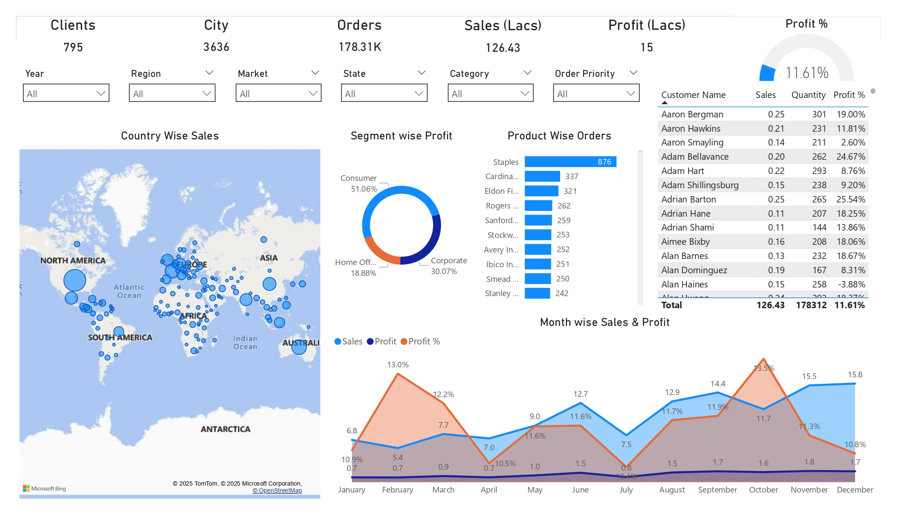

# Enterprise-Grade E-Commerce Sales, Profitability & Customer Intelligence Analytics Platform

> A high-performance interactive business intelligence application engineered to evaluate sales growth, profitability dynamics, customer purchasing behavior, regional market performance, and operational efficiency across a large-scale e-commerce transactional ecosystem.

---

# Dashboard Preview

### 🔹 Executive Sales Performance Console


---

## ⚙️ Technology Stack

| Layer | Technologies |
|---|---|
| Data Source | Microsoft Excel |
| Data Transformation | Power Query (M Language) |
| Data Modeling | Relational Modeling |
| Analytics Engine | DAX Measures |
| Visualization | Microsoft Power BI |
| Business Coverage | Sales, Customers, Profitability, Regional Analytics |

---

# 📂 1. Repository Architecture & File Structure

To maintain clean project organization and enterprise-level analytics documentation standards, all reporting assets, source datasets, and dashboard files are distributed across the following structured repository hierarchy:

```text
Project-2-E-Commerce Sales and Profit Analysis/
│
├── data/
│   └── ECOMM DATA.xlsx                        # Raw e-commerce transactional dataset
│
├── reports/
│   └── E-Commerce Sales and Profit Analysis.pbix   # Main Power BI dashboard application
│
├── exports/
│   └── Screenshot_page-0001.jpg              # Dashboard preview export image
│
├── README.md                                 # Complete project documentation
│
└── docs/
    └── business_requirements.md              # KPI & reporting objective documentation
```

---

# 2. Business Problem & Analytical Objective

Modern e-commerce businesses generate massive transactional data across customers, products, categories, and geographic regions. However, without a centralized analytics platform, organizations struggle to identify:

- High-performing customers and products
- Regional sales concentration patterns
- Profit leakage across operational segments
- Seasonal sales fluctuations and profitability trends
- Fulfillment efficiency and order behavior dynamics

To address these business intelligence challenges, this analytics platform was engineered as a centralized Power BI reporting solution capable of transforming raw transactional records into executive-level operational insights.

The dashboard enables decision-makers to monitor revenue performance, profit margins, customer purchasing behavior, and regional growth opportunities through highly interactive visual exploration layers.

---

# 3. Data Engineering & Analytics Workflow

The project pipeline executes across four integrated analytical stages to convert raw e-commerce transaction records into optimized business intelligence outputs:

```text
[Phase 1: Data Extraction] ➔ [Phase 2: ETL Transformation] ➔ [Phase 3: KPI Modeling] ➔ [Phase 4: Interactive Dashboarding]
(Excel Data Source)          (Power Query Cleansing)         (DAX Measures & Metrics)   (Executive Visualization Layer)
```

---

## 🔹 Phase 1: Raw Business Data Acquisition

The platform utilizes transactional sales data stored inside the source workbook:

```text
ECOMM DATA.xlsx
```

The dataset contains:

- Sales transactions
- Product categories
- Customer-level information
- Regional hierarchy (Country, State, City)
- Order quantity metrics
- Segment-wise profitability records

---

## 🔹 Phase 2: Power Query ETL & Data Transformation

The raw Excel dataset is processed using Power Query transformation pipelines to ensure clean analytical modeling.

### ETL Operations Performed

- Null value handling
- Data type standardization
- Column formatting and renaming
- Sales and profit field sanitization
- Regional hierarchy structuring
- Date formatting optimization

The transformed dataset is then loaded into the Power BI data model for downstream analytics execution.

---

## 🔹 Phase 3: KPI Engineering & DAX Modeling

Dynamic DAX measures were engineered to support real-time analytical calculations and executive KPI tracking.

### Core KPI Metrics

| KPI Measure | Business Purpose |
|---|---|
| Total Sales | Tracks complete revenue generation |
| Total Orders | Measures operational order volume |
| Total Profit | Evaluates profitability performance |
| Profit % | Calculates net profitability efficiency |
| Customer Count | Identifies active customer base |

### Business Metrics Generated

- Month-wise Sales Growth
- Profit Percentage Trends
- Segment-wise Profitability
- Product Order Rankings
- Customer Revenue Contribution
- Regional Performance Analysis

---

## 🔹 Phase 4: Executive Dashboard Visualization Layer

The final reporting application was engineered using a clean executive-style Power BI interface optimized for quick business decision-making.

The visual layout integrates:

- KPI scorecards
- Interactive maps
- Trend analysis visuals
- Customer performance tables
- Regional drill-down filters
- Product performance rankings
- Segment profitability comparisons

The dashboard architecture enables dynamic filtering and real-time analytical exploration without disrupting visual consistency.

---

# 4. Dashboard Analytics & Business Intelligence Features

## 🔹 Executive KPI Ribbon

The dashboard highlights critical business metrics through centralized KPI cards:

| KPI | Value |
|---|---|
| Clients | 795 |
| Orders | 178.31K |
| Sales | ₹126.43 Lakhs |
| Profit | ₹15 Lakhs |
| Profit % | 11.61% |

---

## 🔹 Geographic Sales Intelligence

### Business Objective
Identify high-performing markets and regional revenue concentration zones.

### Features Included

- Country-wise sales mapping
- Regional and state-level filtering
- Interactive geographic drill-down analysis
- Market performance comparisons

---

## 🔹 Time-Series Revenue & Profitability Tracking

### Business Objective
Monitor seasonal revenue fluctuations and monthly profitability behavior.

### Insights Generated

- Month-wise sales performance
- Profit trend tracking
- Profit percentage movement analysis
- Revenue growth comparisons

---

## 🔹 Customer Intelligence & Revenue Contribution

### Business Objective
Identify high-value customers and analyze purchasing contribution patterns.

### Features Included

- Customer-wise sales contribution
- Quantity purchased analysis
- Individual customer profitability tracking
- High-value customer identification

---

## 🔹 Segment & Product Performance Analytics

### Business Objective
Evaluate profitability across customer segments and product categories.

### Insights Generated

- Consumer vs Corporate vs Home Office analysis
- Product-wise order rankings
- Category-level filtering
- Segment profitability breakdown

---

# 5. Business Insights & Strategic Findings

- The dashboard reveals strong revenue concentration across selected customer segments, indicating opportunities for focused retention strategies.
- Regional sales mapping highlights geographic zones with consistently higher purchasing activity and operational performance.
- Product order rankings identify top-performing product categories driving the majority of transaction volumes.
- Monthly sales trend tracking surfaces seasonal spikes and profit fluctuations useful for inventory planning and campaign optimization.
- Customer contribution analysis helps isolate high-value clients responsible for a significant share of revenue generation.

---

# 6. Core Technical Skills Demonstrated

- **Business Intelligence Engineering** (Interactive Dashboard Development & KPI Reporting)
- **Power BI Analytics** (DAX Calculations, Visual Storytelling, Dynamic Filtering)
- **Power Query ETL Pipelines** (Data Cleaning, Formatting & Transformation)
- **Business Performance Analytics** (Sales, Profitability & Customer Analysis)
- **Geographic Intelligence Reporting** (Regional Trend & Map-Based Analytics)
- **Executive Dashboard Design** (Interactive Reporting & Decision-Support Systems)

---

# 7. Operational Deployment Guide

1. Download or clone the repository locally.

```bash
git clone https://github.com/shivee-code/Power-BI_projects_portfolio.git
```

2. Open the Power BI report file:

```text
reports/E-Commerce Sales and Profit Analysis.pbix
```

3. Ensure the Excel dataset path is correctly mapped:

```text
data/ECOMM DATA.xlsx
```

4. Refresh the dataset inside Power BI Desktop to reload all visuals and KPI calculations.

---

# Installation Requirements

| Software | Recommended Version |
|---|---|
| Microsoft Power BI Desktop | May 2026 Release or Later |
| Microsoft Excel | Office 365 / Excel 2021+ |

---

# 8. Future Enhancements

- Predictive sales forecasting integration using Python ML models
- Customer churn risk analysis dashboards
- Inventory optimization analytics
- Real-time sales API integration
- Advanced cohort and retention analysis modules

---

# 👨‍💻 Author

## Shivam Kumar

Aspiring Data Analyst & BI Developer focused on:

- Business Intelligence & Dashboard Engineering
- Financial & Operational Analytics
- Data Visualization & Reporting
- Power BI & DAX Analytics
- Enterprise Analytics Solutions
