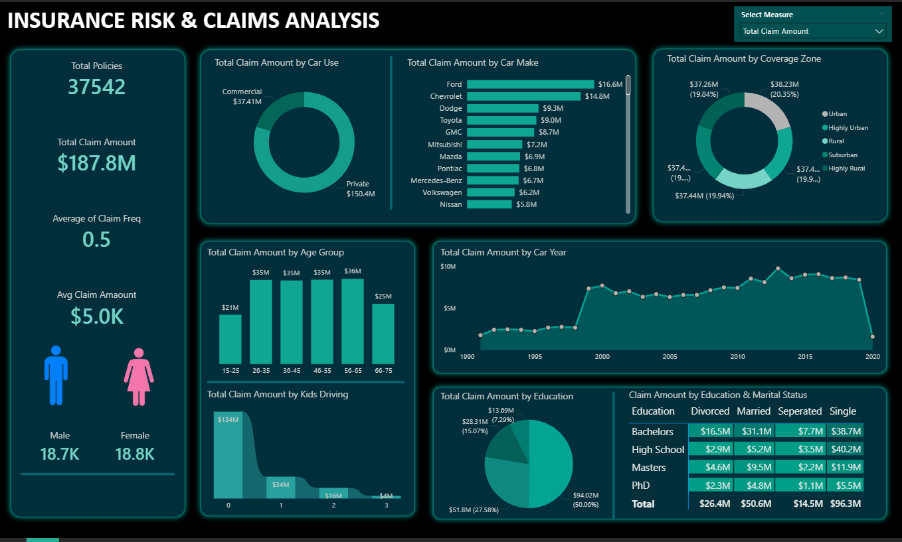

# Insurance Risk & Claims Analysis — Power BI Dashboard

An end-to-end Power BI analytics project designed to analyze insurance policy and claims data, identify key risk factors, and uncover patterns influencing claim behavior and financial exposure.

This project demonstrates practical skills in data modeling, DAX calculations, Power Query transformations, and interactive dashboard development for insurance analytics and risk management.

---

## Dashboard Preview

---

## Project Structure
Project_03_Insurance_Risk_Claims_Analysis/ 
`│` 
`├── data/` 
`│ └── raw/` 
`│ └── insurance_policies_data.xlsx` 
`│` 
`├── reports/` 
`│ └── Insurance_risk_claim_analysis.pbix` 
`│` 
`├── exports/` 
`│ └── dashboard_Screenshot.png` 
`│` 
`├── docs/` 
`│ ├── Business_Requirements.pdf` 
`│ ├── Domain_Overview.pdf` 
`│ ├── executive_summary.md` 
`│ └── methodology.md` 
`│` 
`└── README.md`

---

## Project Objective

To analyze insurance claims data and provide insights into:
- Risk exposure across customer segments
- Claim behavior by vehicle, demographic, and geographic factors
- Historical claim trends to support underwriting and pricing strategies

---

## Key Insights

- High claim concentration observed in urban and highly urban coverage zones.
- Specific car makes contribute disproportionately to total claim value.
- Claim frequency increases significantly with dependent drivers.
- Middle-aged policyholders generate the highest overall claims.
- Education level and marital status show meaningful variations in claim patterns.
- Long-term vehicle trends reflect increasing claim costs over time.

---

## Tools & Technologies

- Power BI Desktop
- Power Query (ETL & Data Transformation)
- DAX (Measures & Calculations)
- Excel (Source Data)
- Data Modeling & Relationships
- Business Intelligence & Dashboard Design

---

## How to Use This Project

1. Download the `.pbix` file from the `reports` folder.
2. Open it using Power BI Desktop.
3. Refresh data if prompted.
4. Use slicers and filters to explore insights interactively.
5. Review supporting documentation in the `docs` folder.

---

## Skills Demonstrated

- Insurance Analytics
- Risk & Claims Analysis
- Data Cleaning & Transformation
- DAX Measures & KPI Design
- Business Intelligence Reporting
- Data-Driven Decision Making

---

## Business Value

This dashboard enables insurance analysts, actuaries, and business stakeholders to:
- Identify high-risk customer segments
- Improve underwriting and pricing strategies
- Monitor claim trends and exposure
- Support strategic planning with data-backed insights

---

## Future Enhancements

- Predictive modeling for claim risk scoring
- Integration with real-time claim feeds
- Advanced forecasting using time-series analysis
- Customer lifetime value (CLV) analysis
