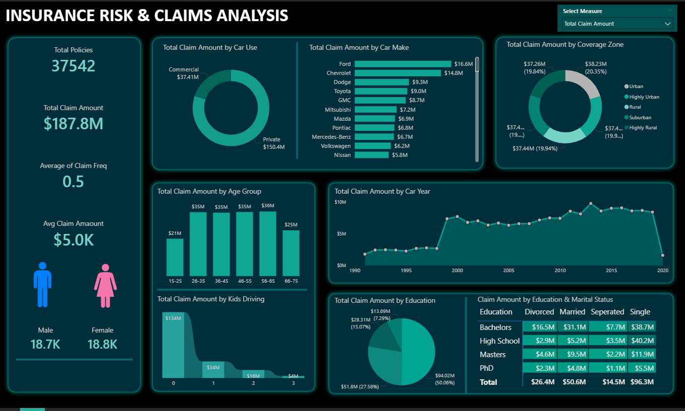

# Enterprise Insurance Risk Exposure & Claims Intelligence Analytics Platform

> An enterprise-grade Power BI analytics solution engineered to evaluate insurance claim behavior, policyholder risk exposure, demographic claim concentration, and underwriting performance across multiple customer and vehicle dimensions.

---

## Dashboard Preview

### 🔹 Insurance Risk Intelligence Console


---

## ⚙️ Technology Stack

| Layer | Technologies |
|---|---|
| Data Source | Microsoft Excel |
| Data Transformation | Power Query (M Language) |
| Data Modeling | Relational Modeling |
| Analytics Engine | DAX Measures |
| Visualization | Microsoft Power BI |
| Business Coverage | Claims Analytics, Risk Segmentation, Underwriting Insights |

---

# 📂 1. Repository Architecture & File Structure

To maintain enterprise-level documentation standards and scalable analytics organization, all datasets, reports, exports, and supporting documents are distributed across the following structured repository hierarchy:

```text
Project_03_Insurance_Risk_Claims_Analysis/
│
├── data/
│   └── raw/
│       └── insurance_policies_data.xlsx        # Raw insurance claims & policy dataset
│
├── reports/
│   └── Insurance_risk_claim_analysis.pbix      # Main Power BI analytical dashboard
│
├── exports/
│   └── dashboard_Screenshot.png                # Dashboard export preview
│
├── docs/
│   ├── Business_Requirements.pdf               # KPI & reporting requirement documentation
│   ├── Domain_Overview.pdf                     # Insurance domain overview
│   ├── executive_summary.md                    # Executive-level business summary
│   └── methodology.md                          # Data modeling & analytical methodology
│
└── README.md                                   # Complete project documentation
```

---

# 2. Business Problem & Analytical Objective

Insurance organizations process large volumes of policyholder and claims data across multiple customer demographics, vehicle categories, and geographic coverage regions. Without centralized analytical systems, insurers face significant challenges in identifying:

- High-risk policyholder segments
- Claim concentration patterns
- Geographic risk exposure
- Vehicle-specific claim behavior
- Long-term claim cost trends
- Underwriting and pricing inefficiencies

To address these operational and underwriting challenges, this analytics platform was engineered as an interactive Power BI reporting solution capable of transforming raw insurance records into actionable risk intelligence.

The dashboard enables analysts and business stakeholders to monitor claims activity, evaluate customer risk patterns, and support data-driven underwriting strategies through dynamic business intelligence workflows.

---

# 3. Data Engineering & Analytics Workflow

The analytics pipeline executes across four integrated processing stages to transform raw insurance records into optimized executive reporting outputs:

```text
[Phase 1: Raw Data Acquisition] ➔ [Phase 2: ETL Transformation] ➔ [Phase 3: KPI Modeling] ➔ [Phase 4: Interactive Risk Visualization]
(Excel Source Dataset)            (Power Query Cleansing)         (DAX Metrics Engine)      (Power BI Dashboard Layer)
```

---

## 🔹 Phase 1: Insurance Data Collection

The platform utilizes structured insurance policy and claims records stored inside the source workbook:

```text
insurance_policies_data.xlsx
```

The dataset includes:

- Policyholder demographics
- Vehicle information
- Claim history
- Geographic coverage details
- Customer marital and education data
- Claim amount and exposure metrics

---

## 🔹 Phase 2: Power Query ETL & Data Transformation

The raw insurance dataset is processed using Power Query ETL workflows to create a clean analytical structure optimized for reporting and KPI calculations.

### ETL Operations Performed

- Null value handling
- Data type standardization
- Geographic hierarchy structuring
- Vehicle category normalization
- Claim amount formatting
- Data cleansing and transformation

The transformed dataset is then loaded into the Power BI relational model for downstream analytical execution.

---

## 🔹 Phase 3: DAX KPI Engineering & Risk Modeling

Dynamic DAX measures were engineered to support real-time insurance analytics and underwriting intelligence reporting.

### Core KPI Metrics

| KPI Measure | Business Purpose |
|---|---|
| Total Claims | Tracks overall claims volume |
| Total Claim Amount | Measures financial exposure |
| Claim Frequency | Evaluates risk occurrence patterns |
| High-Risk Segments | Identifies vulnerable customer groups |
| Geographic Exposure | Tracks regional risk concentration |

### Business Metrics Generated

- Claim concentration by region
- Vehicle-wise claim distribution
- Demographic risk segmentation
- Claim trend analysis
- Customer exposure analytics
- Underwriting performance indicators

---

## 🔹 Phase 4: Executive Risk Intelligence Dashboard

The final reporting platform was designed using a modern Power BI dashboard interface optimized for insurance analytics and executive decision-making.

The dashboard integrates:

- KPI scorecards
- Geographic claim analysis
- Customer demographic segmentation
- Vehicle-based claim breakdowns
- Interactive slicers and filters
- Trend analysis visuals
- Risk concentration insights

The visual reporting layer enables stakeholders to dynamically explore risk patterns and operational exposure without compromising dashboard performance.

---

# 4. Dashboard Analytics & Insurance Intelligence Features

## 🔹 Risk Exposure KPI Console

The dashboard centralizes critical insurance risk indicators into executive KPI cards for quick operational monitoring.

### Core Focus Areas

- Claim volume tracking
- Financial exposure monitoring
- Customer risk segmentation
- Underwriting intelligence
- Geographic exposure evaluation

---

## 🔹 Geographic Claims Intelligence

### Business Objective
Identify regional claim concentration zones and high-risk geographic areas.

### Features Included

- Urban vs rural claim comparisons
- Regional exposure analysis
- Geographic risk concentration mapping
- Interactive location-based filtering

---

## 🔹 Demographic Risk Segmentation

### Business Objective
Analyze claim behavior across customer demographics to support underwriting optimization.

### Insights Generated

- Age-group risk analysis
- Marital status claim comparisons
- Education-level risk exposure
- Dependent driver impact evaluation

---

## 🔹 Vehicle & Policy Risk Analytics

### Business Objective
Identify vehicle categories and policy segments contributing disproportionately to total claims exposure.

### Features Included

- Vehicle-wise claim analysis
- High-risk car make identification
- Long-term vehicle trend tracking
- Policy-level risk breakdowns

---

# 5. Key Analytical Insights & Business Findings

- High claim concentration is observed in urban and highly urban coverage zones.
- Specific vehicle brands contribute disproportionately to overall claim exposure.
- Claim frequency increases significantly among policyholders with dependent drivers.
- Middle-aged customer segments generate the highest total claims volume.
- Education level and marital status display meaningful variations in claim behavior patterns.
- Long-term trend analysis reflects increasing insurance claim costs over time.

---

# 6. Core Technical Skills Demonstrated

- **Insurance Risk Analytics** (Claims Behavior & Exposure Evaluation)
- **Business Intelligence Reporting** (Interactive Power BI Dashboard Development)
- **Power Query ETL Pipelines** (Data Cleaning & Transformation)
- **DAX KPI Engineering** (Dynamic Measures & Risk Metrics)
- **Geographic Intelligence Reporting** (Regional Risk Analysis)
- **Customer Segmentation Analytics** (Demographic & Behavioral Insights)

---

# 7. Operational Deployment Guide

1. Download or clone the repository locally.

```bash
git clone https://github.com/shivee-code/Power-BI_projects_portfolio.git
```

2. Open the Power BI dashboard file:

```text
reports/Insurance_risk_claim_analysis.pbix
```

3. Ensure the source dataset path is correctly mapped:

```text
data/raw/insurance_policies_data.xlsx
```

4. Refresh the dataset inside Power BI Desktop to reload visuals and KPI calculations.

5. Use slicers and filters to explore customer segments, vehicle categories, and regional risk exposure interactively.

---

# Installation Requirements

| Software | Recommended Version |
|---|---|
| Microsoft Power BI Desktop | May 2026 Release or Later |
| Microsoft Excel | Office 365 / Excel 2021+ |

---

# 8. Business Value

This dashboard enables insurance analysts, actuaries, and business stakeholders to:

- Identify high-risk customer segments
- Improve underwriting and pricing strategies
- Monitor claims exposure and operational risk
- Support strategic insurance planning with data-driven insights
- Evaluate demographic and geographic claim concentration patterns

---

# 9. Future Enhancements

- Predictive claim risk scoring models
- Real-time insurance claims integration
- Advanced time-series forecasting analytics
- Customer lifetime value (CLV) analytics
- AI-driven underwriting recommendation systems

---

# 👨‍💻 Author

## Shivam Kumar

Aspiring Data Analyst & BI Developer focused on:

- Insurance Risk Analytics
- Power BI Dashboard Engineering
- Business Intelligence Reporting
- Data Visualization & Analytics
- Enterprise Analytics Solutions
